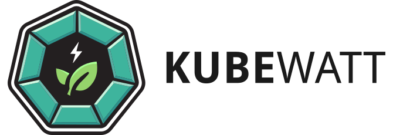

  <picture>
    
  </picture>

KubeWatt is a metrics collector for Kubernetes that estimates the amount of power used per Kubernetes container.
KubeWatt collects power usage per node from a power source such as Redfish and collects container and node CPU-usage
metrics from the Kubernetes metrics API.

For more information on KubeWatt, please refer to the associated research paper. [Pre-print is available here.](https://arxiv.org/abs/2504.10702)

## Usage

To run KubeWatt, use the supplied Helm Chart. See `values.yaml` for configuration parameters and refer to the
configuration section below.

Before starting KubeWatt, some parameters must first be initialized. This is done by running the KubeWatt `INIT_BASE` or
`INIT_BOOTSTRAP` jobs.

- `INIT_BASE` runs KubeWatt initializer against a completely empty cluster apart from the control plane. This will
  quickly and accurately initialize the static power value.
- `INIT_BOOTSTRAP` runs KubeWatt initializer against a non-empty cluster. The static power value will be inferred from
  the load/power values of running loads. Note that some data validation is performed and that KubeWatt requires broadly
  and uniformly distributed data. If this does not happen on your cluster, refer to the logging of KubeWatt and run
  additional CPU stressors as required.

Both init modes will output a static power value per node. Add these to the configuration before running KubeWatt in its
main, `ESTIMATOR`, mode.

## Configuration

The file [config.json](config.json) includes a sample configuration file. For deployment on Kubernetes, these values
should be included in [values.yaml](chart/values.yaml) under the `config` path.

The following options are available:

| option                                     | type                                             | explanation                                                                                                                                                                 |
|--------------------------------------------|--------------------------------------------------|-----------------------------------------------------------------------------------------------------------------------------------------------------------------------------|
| mode                                       | `ESTIMATOR` or `INIT_BASE` or `INIT_BOOTSTRAP`   | Which mode to run KubeWatt in.                                                                                                                                              |
| datastorage                                |                                                  | Options related to debug data exports                                                                                                                                       |
| datastorage.mode                           | `FILE`, `EMAIL` or `NONE`                        | If `FILE`, data is stored to a .csv file. IF `EMAIL`, data is sent as an e-mail attachment. Note that `EMAIL` uses `FILE` under the hood. Applies only to the `INIT` modes. |
| datastorage.path                           | Path                                             | Where to store the data files. Optional for both `FILE` and `EMAIL`.                                                                                                        |
| datastorage.email.hostname                 |                                                  | SMTP Hostname                                                                                                                                                               |
| datastorage.email.port                     |                                                  | SMTP Port                                                                                                                                                                   |
| datastorage.email.use-ssl                  |                                                  | Does the SMTP server use SSL?                                                                                                                                               |
| datastorage.email.username                 |                                                  | SMTP server username                                                                                                                                                        |
| datastorage.email.password                 |                                                  | SMTP server password                                                                                                                                                        |
| datastorage.email.from                     |                                                  | E-mail sender                                                                                                                                                               |
| datastorage.email.recipient                |                                                  | E-mail recepient                                                                                                                                                            |
| collector                                  |                                                  |                                                                                                                                                                             |
| collector.node-names                       | String[]                                         | A list of all node names in the Kubernetes cluster KubeWatt will run against                                                                                                |
| collector.node-static-power                | Map<NodeName,Double>                             | The static power value for each node. Required when running in `ESTIMATOR` mode. The keyset must be exhaustive.                                                             |
| collector.power                            |                                                  |                                                                                                                                                                             |
| collector.power.source                     | `REDFISH` is the only option currently supported | Where KubeWatt should take its power readings from.                                                                                                                         |
| collector.power.redfish                    | Map<NodeName,RedfishConfig>                      | The Redfish config for each node. Keyset must be exhaustive.                                                                                                                |
| collector.power.redfish.*n*.host           | URL                                              | The Redfish host for node *n*                                                                                                                                               |
| collector.power.redfish.*n*.systems        | String[]                                         | The list of Redfish API ComputerSystems to use for node *n*                                                                                                                 |
| collector.power.redfish.*n*.username       | String                                           | Redfish username for node *n*                                                                                                                                               |
| collector.power.redfish.*n*.username       | String                                           | Redfish password for node *n*                                                                                                                                               |
| collector.utilization                      |                                                  |                                                                                                                                                                             |
| collector.utilization.control-plane-pods   | String[]                                         | A list of regular expressions which match podnames for control plane pods.                                                                                                  |
| bootstrap-initializer                      |                                                  |                                                                                                                                                                             |
| bootstrap-initializer.bucket-percent-start | Integer between 0 and 100                        | The start of the smallest bucket for INIT_BOOTSTRAP in CPU%                                                                                                                 |
| bootstrap-initializer.bucket-percent-end   | Integer between 0 and 100                        | The end of the largest bucket for INIT_BOOTSTRAP in CPU%                                                                                                                    |
| bootstrap-initializer.bucket-size          | Integer between 1 and 100                        | The size of the buckets for INIT_BOOTSTRAP in CPU%                                                                                                                          |
| bootstrap-initializer.min-mult             | Number between 0 and 1                           | The minimum number of measurements each bucket must contain compared to the largest bucket                                                                                  |

